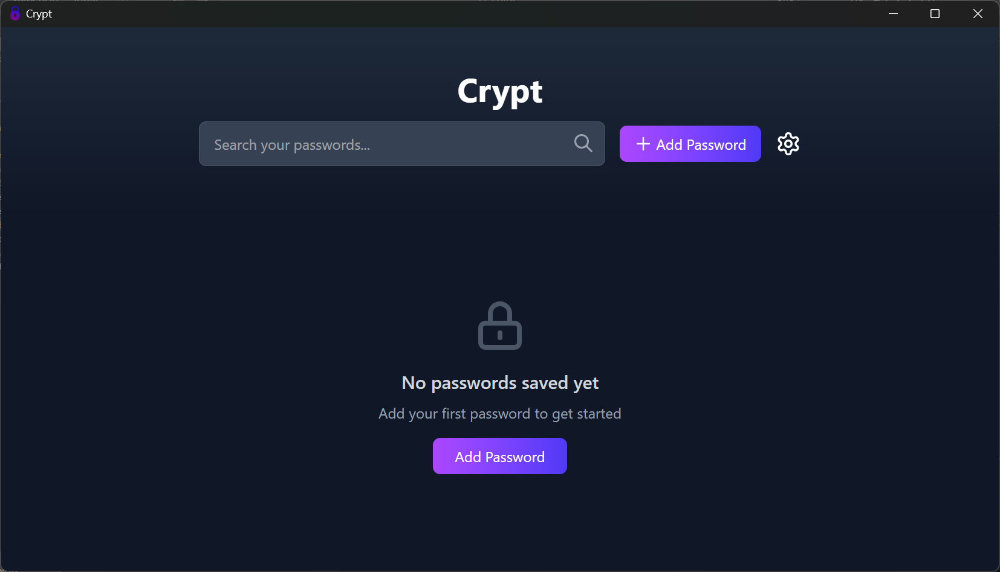
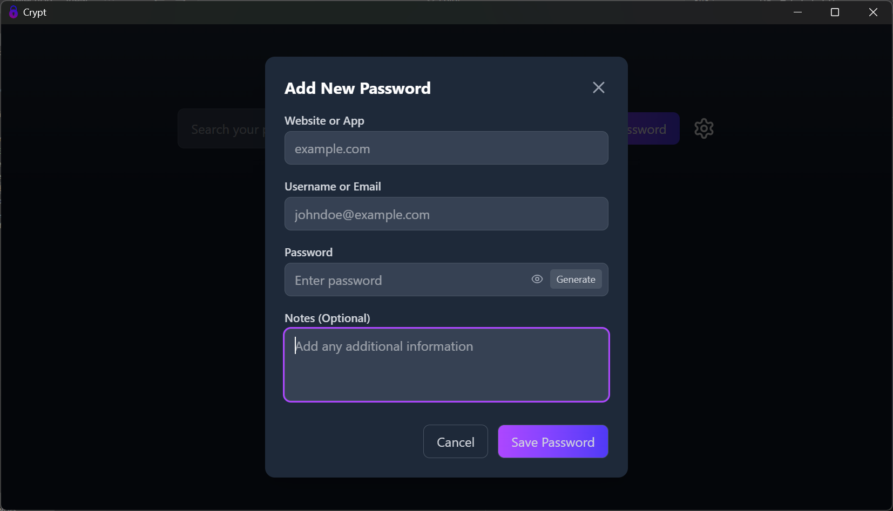

    
    
Crypt

## Crypt

**Crypt** is an open source password manager for your passwords built on Tauri + Svelte.

[Download Link](https://github.com/TAFH-debug/crypt/releases)

## Features

* Aes256Gcm encryption with key generated from master password via PBKDF2.
* Only local storage of your passwords.
* Blazingly fast and small binary size (~9 Mb).

## Screenshots

## LICENSE

[MIT](https://opensource.org/license/mit/)
